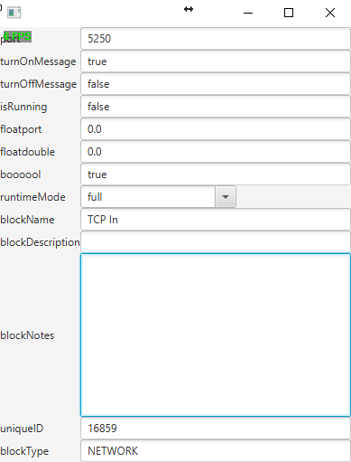

# TransferGrid
This library uses reflection to create a JavaFX GridPane with all annoted variables aswell as fields to edit them.

## Table of content

- [Why](#Reasoning)
- [Goals](#Goals)
- [Current Status](#Current-Status)
- [HowTo](#HowTo)
  - [Transfergrid](#Transfergrid)
  - [ReflectorGrid][(#ReflectorGrid)
  - [Usage](#Usage)

## Why

After quite some work on my [Graphical Programming Interface](https://github.com/FancyJavaStuff/GPI) and using quite a bit of [GSON](https://github.com/google/gson), I decided to create a way of generating a GridPane for objects. This lead me to this library, which was primarly developed on the GPI repo and has now been separated into a separate one.

This was heavily inspired by [GSON](https://github.com/google/gson) and it was used as reference for quite some stuff, so thank you [@Google](https://github.com/google)!

## Goals

Even thought this project is finished for now, I have some future goals

* Implementation of custom Adapters
  - Enable users to create their own Adapters for variable types that are not primitive

## Current Status

Currently Version 1.0 is released and free to use. If you find any issues, please report them. Feel free to also give any recommendantions!
It works with int, boolean, String, float and double types, and can also reflect upon variables of inhereted classes.

## HowTo

To use the ReflectorGrid, you have to use the <b>@Transfergrid</b> annotation.

Using the <b>@Transfergrid</b> annotation makes the ReflectorGrid see the variable. All variables that do not have the annotation will be ignored.

[Transfergrid.java](https://github.com/FancyJavaStuff/TransferGrid/blob/master/src/ch/rs/reflectorgrid/Transfergrid.java) contains several functions to give you more customization:

<b>public boolean editable () default true</b>
Lets you make a annoted variable uneditable, so that the user can only see what is in it.

<b>public String[] options () default {}</b>
This function enables you to set options for the variable. This turns the variable into a ComboBox, from which the user can pick an option you set here. Please bear in mind that putting something into options() will result it always turning into a ComboBox, no matter what you set in <b>fieldtype()</b>

<b>public Fieldtype fieldtype () default Fieldtype.TEXTFIELD</b>
This function can be set to one of the following enums:

<i>TEXTFIELD, TEXTAREA</i>

Its default value is <i>TEXTFIELD</i>. If you have a variable that resembles something like notes, or a text, you can set it to <i>TEXTAREA</i> to generate a better fitting field.


### Transfergrid

To use this library, you first have to initiate a ReflectorGrid.
```
ReflectorGrid gridGenerator = new ReflectorGrid();
```

You can then set different parameters for the gridGenerator itself. The avaliable functions for that are:

<b>public void setSideBySide()</b>
This generates the Grid using the following format:

Label | Field
Label | Field 
Label | Field


<b>public void setAboveEach()</b>
This generates the Grid using the following format:

Label
Field
Label
Field
Label
Field


<b>public void setNodeWidthLimit(double limit)</b>
This allows you to set a limit to how Width the TextFields/Areas can get.


<b>public GridPane turnObjectIntoGrid(Object object)</b>
This function is where you give the ReflectorGrid your object. It will then go on and generate everyhing according to the annotations aswell as to the parameters of the generator you set. In the end, it'll return a GridPane containing all your defined variables.

As soon as you place the GridPane in your GUI, calling <b>public GridPane turnObjectIntoGrid(Object object)</b> again with a different Object will automaticly update the GUI with the new values.


## Usage

Here is an example of a Classn where this is used:

```
public class TCPIn extends LogicBlock {

    @Transfergrid
    private int port = 8080;
    
    private String temporaryValue = "temporary";
    
    @Transfergrid
    private String turnOnMessage = "turnOn";

    @Transfergrid
    private String turnOffMessage = "turnOff";
    
    @Transfergrid(editable = false)
    private boolean isRunning = false;
    
    @Transfergrid
    private float floatport = 0.0f;
    
    @Transfergrid
    private double floatdouble = 0.0;
    
    @Transfergrid(options = {"full", "half", "none"})
    private String runtimeMode = "full";

```

```
public abstract class LogicBlock implements Observer{

    @Transfergrid
    private String blockName;

    @Transfergrid
    private String blockDescription;
    
    @Transfergrid(fieldtype = Fieldtype.TEXTAREA)
    private String blockNotes;
    
    @Transfergrid(editable = false)
    private String uniqueID;

    @Transfergrid(editable = false)
    private BlockType blockType;
```

Using the following function:
```
ReflectorGrid gridGenerator = new ReflectorGrid();
gridGenerator.turnObjectIntoGrid(new TCPIn());
```

Gives us the following Result:

<p align="left">
  
</p>

As you can see, you get a barebones grid. You can then set it up to your liking with spacing and all. An additional benefit of this library: setting the paddings etc. once is enough, however many times you generate a grid, they will stay the same!
